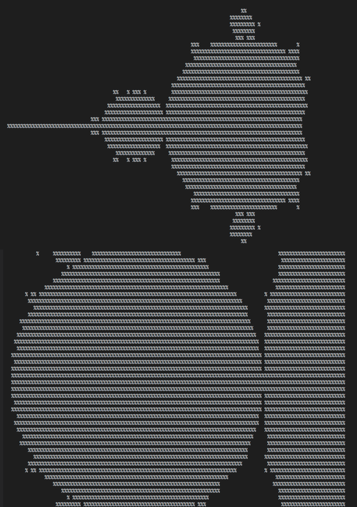

# mandelbrot-ascii

An interactive plot of the Mandelbrot Set drawn using ASCII in your terminal! The program is written in C and may look vaguely familiar.

```c
                                                                        //
                                                                    struct C
                                                                    {double r ;
                                                                     double i
                                                                      ;}; ///
                                                       /**    */struct C o={.r=0.0,.i    //
                                                       =0.0};struct C sq(struct C z){// ////
                                                        struct C m={.r=(z.r*z.r)-(z.i*z.i),.
                                                    i=2*z.r*z.i};return m;}struct C ad(////
                                                   struct C a,struct C b){struct C s={.r=a.r+
                                                  b.r,.i=a.i+b.i};return s;}struct C f(struct
                            C   z  /** *        */,struct C c){struct C m=ad(sq(z),c);return m;
                            }double d(/**      */struct C a,struct C b){return sqrt(pow(a.r-b.
                          r,2)+pow(a.i-b.i,2  ));}double st(int i,struct C z,struct C c,double
                         t){if(d(z,o)>2){/*** */return 0;}struct C m=f(z,c);if(d(z,m)<t||i>//
                    200 ){return(double)1/i;}return st(i+1,m,c,t);}int main(){struct C c;///
/**********************/double s;double sc=1;double ps=1;double r=-2.0;double pr=-2.0;double
                    i=1 ;double pi=1;int h=R*2/3;int w=R*2;int n=0;for (;;){for(int j=0;j<h;j
                        ++){for(int k=0;k<w;k++){c.r=r+(double)k*sc*(double)3/(R*9/4);c.i=i-//
                          (double)j*sc*(/**   */double)3/R;s=st(1,f(o,c),c,0.1);char sh=s>0?'%'
                             :' ';printf/*     */("%c",sh);}printf("\n");}scanf("%d", &n);////
                                                printf("\n");if(n<0)return 0;else if(n==0){sc=
                                                  ps;r=pr;i=pi;}else{ps=sc;sc=sc/2;pi=i;pr=r
                                                   ;if(n>=7){r+=sc*(n-7);}else if(n>=4){i-=
                                                     sc;r+=sc*(n-4);}else if(n>=1){i-=sc*2;
                                                        r+=sc*(n-1);}}}return 0;}/*%%%%%%% &&&
                                                       %%%   %%%%%%%%%%%%%%%%%%%%%%%%%%%%    %
                                                                      %%% %%%
                                                                    %%%%%%%%% %
                                                                    %%%%%%%%%
                                                                         */
```
## How to Use

Simply clone the repo and run `make run`. The iamge is split into nine quadrants that can be zoomed in on, which correspond to the numbers on a keyboard's numberpad. Enter a number between 1 and 9 to zoom in, 0 to go back and -1 to exit the program.

## Program Output




