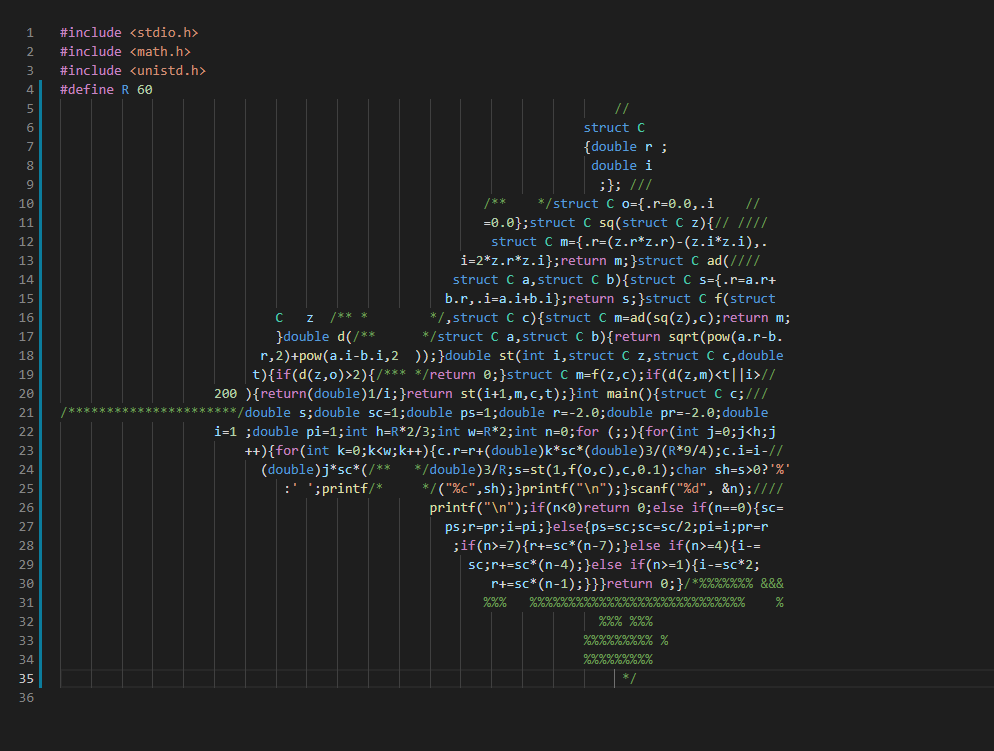

# mandelbrot-ascii

An interactive plot of the Mandelbrot set drawn using ASCII in your terminal! The program is written in C and may look vaguely familiar.

## How to Use

Simply clone the repo and run `make run`. The iamge is split into nine quadrants that can be zoomed in on, which correspond to the numbers on a keyboard's numberpad. Enter a number between 1 and 9 to zoom in, 0 to go back and -1 to exit the program.
